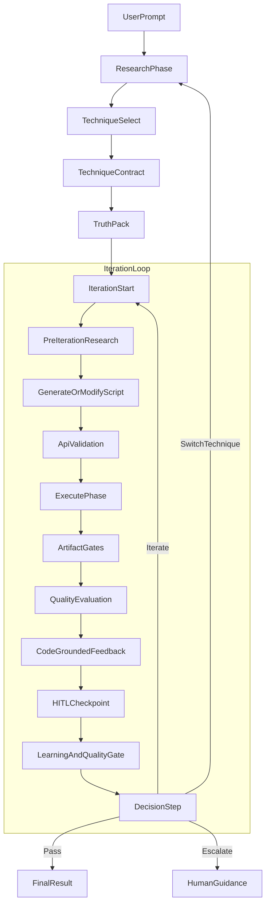
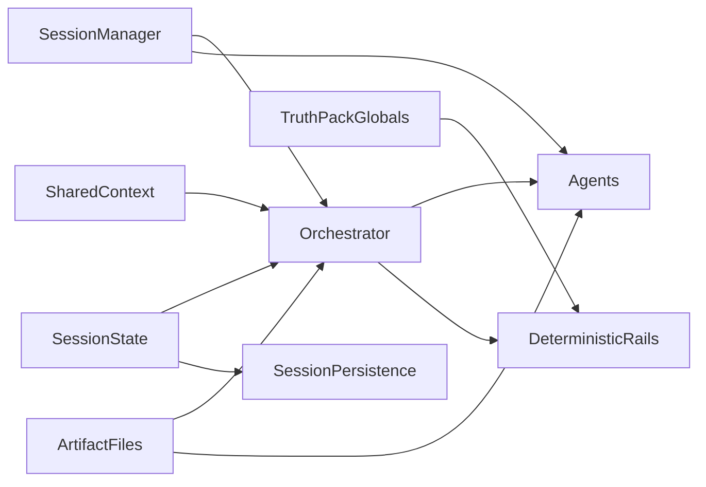

# Comprehensive Multiagent System Analysis

**Date:** 2026-03-13  
**Scope:** `agents/blender-vfx-orchestrator/`  
**Method:** Mission-first, Wave 2-aware, code-verified review

## Executive Summary

The Blender VFX Orchestrator is no longer best described as a free-form multi-agent swarm. In live code, it is a Python-owned state machine with a small number of bounded LLM subroutines, surrounded by a large deterministic control and correction layer. That architectural shift is correct and valuable: it preserves creative generation where LLMs add the most value while moving execution, validation, and safety toward code.

Wave 1 and early Wave 2 work solved or materially improved several real problems: technique monotony is much less severe, the truth-pack stack has significantly reduced Blender 5 hallucinations, context handling is better, and the system now has live evidence across more physics families than the mission statement's then-current implementation-status table reflected. The main blockers have moved.

The most important remaining problems are now: iteration-state integrity, fragmented state ownership, partially disconnected enforcement layers, uncalibrated reward and learning loops, and authority drift between "official" docs and the runtime that actually exists. The project is much closer to a capable experimental pipeline than to a trustworthy autonomous self-improving system. The next step is not "more agents" or "more patch layers." The next step is making the iteration, evaluation, and learning loops trustworthy enough that autonomy claims mean something.

## Current Truth Baseline

This analysis assumes the following as the present baseline:

| Item | Current baseline | Why this matters |
| --- | --- | --- |
| SDK runtime | `openai-agents==0.12.0` in `requirements.txt` | Older docs that describe `0.8.3` or `0.10.5` are stale on important capabilities such as native approvals and retry settings. |
| Primary generation mode | `script_writer` mode is live; spec-first is deprecated in runtime metadata | Several authority docs still describe spec-first as active. |
| Pipeline owner | `BlenderVFXOrchestrator.create_asset_pipeline()` is the real control plane | The project is code-orchestrated, not prompt-orchestrated. |
| Execution path | Deterministic execution via `_execute_blender_script_impl()` | The historical `Executor` agent is no longer the hot path. |
| Session mode | Iterations are stateless by default | Some docs still assume shared SDK session context across all phases. |
| Active topology | 5 standalone agents + 3 coordinators | This is smaller and more deterministic than the historical agent map suggests. |
| Recovery path | Section patching exists and is budgeted | But it is not yet fully proven in the live loop. |
| Main open blocker | Stale render reuse / invalid iteration-state promotion | This undermines evaluation, learning, and escalation. |

One small but important code excerpt captures the architecture drift from older docs:

```python
trace_meta = {
    "asset_name": request.asset_name,
    "effect_type": request.effect_type.value,
    "session_id": session.session_id,
    "generation_mode": "script_writer",  # Phase 2A-6: spec-first deprecated
}
```

That single line matters because several "official" docs still describe spec-first as enabled by default.

## Authority Map And Freshness

The repo no longer has one clean, internally consistent authority stack. It has three overlapping layers:

1. Vision and product intent
2. Runtime and SDK/API truth
3. Current status / roadmap interpretation

The problem is that those layers are not fully aligned.

| Source | Best used for | Freshness | Assessment |
| --- | --- | --- | --- |
| `docs/MISSION_STATEMENT_2026-02-22.md` | Canonical product vision, design principles, success criteria | Medium | Still the best intent document. Not reliable as an exact implementation-status document. |
| `docs/VERSION_TRUTH.md` | Best current model / SDK / Blender truth | High | Most reliable single source for current SDK/model/runtime assumptions. |
| `docs/RUNTIME_TRUTH_AND_DOC_GROUNDING_2026-02-13.md` | Declared runtime truth and doc-grounding policy | Low-Medium | Important because it self-declares authority, but stale on SDK pin and spec-first status. |
| `docs/DOCS_AUTHORITY_AND_FRESHNESS_2026-02-13.md` | Declared authority order | Low-Medium | Still useful, but it routes readers toward a stale runtime-truth file. |
| `docs/AI_OPERATION_MANUAL.md` | Operational invariants, artifact-first philosophy, quality-gate rules | Medium | Good on shape and intent, stale on exact runtime details. |
| `docs/prompts/GPT54_ARCHITECTURE_REVIEW_PROMPT.md` | Historical March 11 problem framing | Medium | Still valuable as a baseline diagnosis. No longer current-state truth. |
| `docs/prompts/HIGH_LEVEL_AUTONOMY_CODE_REVIEW_PROMPT_20260313.md` | Useful lens for next-order review | High | Better than the earlier prompt for current strategic questions. |
| `docs/reviews/2026-03/20260312_WAVE2_STATUS_AND_PATH_FORWARD.md` | Best implementation-status report | High | Strong status/evidence document. |
| `docs/reviews/2026-03/20260313_ARCHITECTURE_REVIEW_WAVE2_RESPONSE.md` | Best current architecture reassessment | High | Most accurate March planning/status synthesis in the repo. |

### Tie-Breaker Rule For This Analysis

For this document, the tie-breaker order is:

1. Live runtime code in `orchestrator.py`, `phases/`, `guardrails/`, `hooks/`, `tools/`, and `models/`
2. `docs/VERSION_TRUTH.md`
3. The 2026-03-12 / 2026-03-13 Wave 2 documents
4. `docs/RUNTIME_TRUTH_AND_DOC_GROUNDING_2026-02-13.md` and `docs/AI_OPERATION_MANUAL.md`
5. `docs/MISSION_STATEMENT_2026-02-22.md` for product intent, not implementation detail

This is not how the repo formally declares authority, but it is the only order that produces a current-state-accurate review.

## Mission Alignment Snapshot

The mission statement is still directionally correct, but the live system is uneven across its success criteria.

| Mission criterion | Current status | Assessment |
| --- | --- | --- |
| Natural language -> complete creative scene generation | Partial | The Script Writer still produces large, scene-level scripts and creativity remains visible, but the canonical prompt-enhancement and pre-spend prompt-approval stages are still mission gaps in the live runtime. |
| Reliability before capability | Partial | Better than before, but stale render reuse means the iteration loop can still lie to itself. |
| Any Blender physics family, not just Mantaflow | Partial-Strong | The architecture clearly expanded beyond Mantaflow; cloth and rigid-body evidence exists, but broad production reliability does not. |
| Self-improving over time | Weak-Partial | The machinery exists, but the trustworthiness of the learning signal is still not good enough. |
| Honest about failure | Partial | Diagnostics are often good, but stale artifact reuse and evaluator ambiguity can blur the true failure mode. |
| Earn autonomy through evidence | Weak | Autonomy levels exist in concept and partially in code, but there is no strong benchmark-gated promotion framework yet. |

The mission statement's ranked principles still hold up very well:

- `P1 Reliability Before Capability` remains the right top principle.
- `P2 LLM Creativity Is the Core Value` remains correct and should be defended.
- `P3 Blender Is the Source of Truth` is one of the system's strongest implemented ideas.
- `P4 Compute What You Can, Generate What You Must` describes the architecture more accurately now than when it was written.
- `P5 Context Is Precious` is partially honored, but state/data flow is still noisier than it should be.
- `P6 Every Run Produces Learning Signal` is only true if the run's artifacts and evaluation are trustworthy.
- `P7 Earn Autonomy Through Evidence` is still more aspiration than enforcement.

One important mission/runtime gap needs to be stated explicitly: the canonical user experience in the mission statement includes prompt enhancement and human approval before spending API budget, but the live runtime starts from a raw `AssetRequest.description` and enters the pipeline at research/generation. That does not invalidate the architecture review, but it does mean the current system is closer to "creative autonomous generation core" than to the full mission-defined product loop.

## Effective Architecture: What The System Actually Is

The live system is best described as **deterministic orchestration with bounded LLM specialists**.

It is not:

- a peer-to-peer agent swarm
- an LLM-only loop
- a template-driven generator

It is:

- a Python-owned pipeline loop in `orchestrator.py`
- a startup phase split across `phases/research.py`
- a deterministic execution/recovery layer in `phases/execution.py`
- a limited set of active agents at decision-heavy points
- a dense deterministic rail stack around those agents



### Active Runtime Topology

The active topology is assembled in `BlenderVFXOrchestrator.initialize()`:

- `Research Agent`
- `Script Writer`
- `Quality Analyst`
- `Learning Agent`
- `Documentation Expert`
- `Technique Selector`
- `Modification Strategist`
- `Quality Gate Judge`

The `Executor` agent is explicitly removed from the hot path:

```python
# Phase 2A-7: Executor agent REMOVED — execution is deterministic.
# Pipeline calls _execute_blender_script_impl() directly (see PHASE 2: EXECUTION).
```

That is a healthy simplification. The project should continue in that direction.

### LLM Responsibilities Vs Deterministic Responsibilities

| Responsibility | Current owner | Assessment |
| --- | --- | --- |
| Research synthesis | LLM | Reasonable place for model use. |
| Docs retrieval | Mixed | Should become more bounded and deterministic. |
| Technique selection | LLM coordinator | Useful, but some of the logic could be reduced to policy code. |
| Technique binding | Deterministic `TechniqueContract` + packs | One of the biggest recent improvements. |
| Truth-pack build | Deterministic Blender introspection | Correct. |
| Script generation | LLM | Correct place to preserve creativity. |
| Script patching | Mixed | Good direction, but production proof is still pending. |
| API validation and correction | Deterministic | Correct. |
| Execution | Deterministic | Correct. |
| Artifact gating | Deterministic | Correct and important. |
| Visual quality judgment | Hybrid | Necessary, but not yet sufficiently calibrated. |
| Learning / experiment logging | Mixed | Too much of this is still in the hot path. |

## Agent Roster: What Is Central Vs Historical

### Central To The Live Spine

| File | Runtime importance | Why |
| --- | --- | --- |
| `orchestrator.py` | Critical | Owns the real control flow and most remaining complexity. |
| `phases/research.py` | High | Startup phases, preflight, technique selection, contract build, truth-pack setup. |
| `phases/execution.py` | High | Deterministic execution, recovery, artifact gates, and the current stale-render bug. |
| `specialized_agents/script_writer.py` | High | Core creative generation path. |
| `specialized_agents/quality_analyst.py` | High | Main visual-evaluation path. |
| `specialized_agents/learning_agent.py` | High | Core of the current self-learning story, though overloaded. |
| `tools/truth_pack.py` | Critical | Main Blender-grounded anti-hallucination layer. |
| `tools/script_generator_tools.py` | High | Script write/modify/validate tooling. |
| `tools/blender_executor_tools.py` | Critical | Actual execution engine. |
| `tools/asset_evaluator_tools.py` | High | Evaluation tooling. |
| `tools/semantic_docs_tools.py` | High | Research grounding. |

### Important But Secondary

| File | Role |
| --- | --- |
| `coordinator_agents.py` | Decision coordinators |
| `guardrails/artifact_gates.py` | Deterministic execution sanity checks |
| `guardrails/script_guardrails.py` | Research-context and output validation |
| `guardrails/quality_guardrails.py` | Budget and quality-output validation |
| `hooks/enforcement_hooks.py` | Loop / doc-query enforcement |
| `utils/hitl_handler.py` | Pipeline-level HITL checkpoints |
| `session_manager.py` | Derived issue tracking and prompt-facing context |

### Historical Or Semi-Vestigial

| File | Current status |
| --- | --- |
| `specialized_agents/executor.py` | Historical; not hot path |
| `specialized_agents/api_spec_agent.py` | Historical |
| `specialized_agents/code_writer_agent.py` | Historical |
| `models/api_spec.py` | Compatibility baggage from spec-first era |
| `tools/generate_agent_graph.py` | Utility, not runtime spine |
| `tools/trace_analyzer.py` and `tools/trace_visualizer.py` | Useful diagnostics, not active control-path logic |
| `specialized_agents/api_validator.py` | Partly active by helper usage, not as a central live agent |

This matters because many older docs still describe a larger and more uniformly "agentic" system than the one that actually exists.

## State, Memory, And Artifact Flow

The system's most important architectural weakness is not just file size. It is **split state authority**.

There are at least five meaningful state channels:

| State channel | Role | Problem |
| --- | --- | --- |
| `SessionState` | Persisted run/session truth | Not always updated through its own authoritative methods |
| `SharedContext` | Transient per-run working state | Accumulates compatibility baggage and write-only fields |
| `SessionManager` | Derived prompt-facing issue tracker and history summarizer | Often more operationally important than persisted session fields |
| Artifact files | File-based handoff layer | Good idea, but not all intended artifacts are clearly emitted in the live path |
| Global truth-pack holders | Validator/guardrail runtime state | Session-unsafe if runs overlap |



### The Concrete Drift

`SessionState.record_iteration()` exists specifically to update:

- iteration history
- best score
- passed/final outputs
- stuck-state escape tracking

But the hot path appends iteration results directly:

```python
quality_metrics = QualityMetrics(
    overall_score=quality.overall_score,
    passed=quality.passed,
    issues=quality.issues,
    primary_issue=quality.primary_issue,
    suggestions=quality.recommendations if hasattr(quality, 'recommendations') else [],
)
iter_result = IterationResult(
    iteration=iteration,
    script=script_mod,
    execution=blender_exec,
    quality=quality_metrics,
    passed=quality.passed,
    score=quality.overall_score,
)
session.iterations.append(iter_result)
```

That bypass matters because `SessionState.record_iteration()` is where the intended stuck-state updates live:

```python
def record_iteration(self, result: IterationResult) -> EscapeLevel:
    self.iterations.append(result)
    self.current_iteration = result.iteration
    ...
    escape_level = self.stuck_state.update_from_iteration(
        score=result.score,
        primary_issue=primary_issue,
        technique_used=technique
    )
```

### Why This Matters

This split means the system has two overlapping stories about progress:

- the persisted session model story
- the derived operational `SessionManager` story

That creates several risks:

- state fields can silently drift
- the wrong object becomes authoritative for escape / stall logic
- persisted session data may not reflect the same truth that guided the live run
- testing becomes harder because policy lives across multiple state owners

## Enforcement Stack: Strong In Principle, Uneven In Practice

The project has a lot of enforcement. The problem is not "lack of rails." The problem is **rail alignment**.

### What Is Strong

| Layer | Strength |
| --- | --- |
| `hooks/enforcement_hooks.py` | Real mechanical loop detection, doc-query enforcement, and turn-budget enforcement for the main standalone agents |
| `guardrails/research_guardrails.py` | Strong grounding pressure on research output |
| Truth pack + validator | The most valuable anti-hallucination infrastructure in the repo |
| `guardrails/artifact_gates.py` | Deterministic execution sanity checks before expensive evaluation |
| Structured outputs in `models/pipeline_models.py` | Good type contracts between phases |

### What Is Misaligned Or Weak

| Layer | Weakness |
| --- | --- |
| Tool guardrails in `guardrails/tool_guardrails.py` | Attached to `execute_blender_script` and `generate_script`, but live code often uses `_execute_blender_script_impl()` and direct LLM write/modify paths instead |
| Script modification path | `_modify_script_impl()` is called directly, bypassing the `modify_script` tool wrapper path |
| Budget guardrail | `check_budget_before_quality()` can fail open and fall back to global tracker behavior |
| `require_research_context` | Heuristic keyword matching, not provenance-aware grounding |
| Coordinator path | Coordinators get output guardrails, but not the same enforcement hooks as the main agents |

The direct-implementation bypass is visible in code:

```python
# phases/execution.py
exec_json_str = await _execute_blender_script_impl(
    script_path=script.script_path,
    script_args={"bake": "1"},
    output_dir=exec_output_dir,
    timeout_seconds=600,
)
```

and:

```python
# orchestrator.py
# Call _modify_script_impl directly (sync function), NOT the
# @function_tool-wrapped modify_script
result_raw = _modify_script_impl(
    script_path=script_path,
    modifications=modifications,
    output_name=output_name,
)
```

This does not mean the project should add even more guardrails. It means the project should choose one authoritative enforcement path per phase and make the hot path actually use it.

## What Wave 1 And Wave 2 Already Fixed

It would be a mistake to re-review this system as if it were still in the pre-March state.

| Issue family | Current status | Comment |
| --- | --- | --- |
| Technique monotony | Mostly improved at selection time | The system now has `TechniqueContract` and capability-pack binding. |
| Blender API hallucinations | Significantly improved | Truth-pack + validator + fixer stack is one of the repo's strongest achievements. |
| Cross-physics generalization | Materially improved | The architecture has clearly moved beyond Mantaflow-only behavior. |
| Context bloat | Partially improved | `call_model_input_filter` and artifact-first handoffs helped, but the loop is still context-heavy. |
| Destructive full recovery rewrites | Partially improved | Section patching is the right answer, but production proof is still pending. |
| Monolithic architecture | Partially improved | `phases/research.py` and `phases/execution.py` are real seams, but the core loop remains concentrated in `orchestrator.py`. |

The March roadmap was not wrong. It was mostly right. The problem is that the next blocker moved.

## Remaining High-Leverage Risks

### 1. Iteration-State Integrity Is Still The Most Important Blocker

**Problem:** A failed execution can still be treated as effectively successful if any render is found on disk.

**Why it still matters after the current roadmap:** This is now more important than technique binding. If the system cannot tell which script produced which image, everything downstream becomes suspect.

**Evidence:** `phases/execution.py` scans sibling and child directories for renders and then promotes `success=False` to `success=True` if it finds one.

```python
found = _discover_render(exec_output_dir, execution.run_dir)
if found:
    execution.render_path = found
...
if execution.render_path and not execution.success:
    ...
    execution.success = True
```

**Likely consequence if ignored:** The system will continue to poison its own feedback loop. It will evaluate stale images, under-trigger `modify_code`, under-trigger technique switches, and log misleading learning signals.

**Most practical intervention:** Make render validity iteration-scoped, not path-scoped. Use a current-iteration manifest keyed by iteration id, script hash, and run dir. Failed runs may expose a `partial_render_path` for diagnostics, but they must not be promoted to success for scoring.

**Roadmap coverage:** Partially covered in the latest Wave 2 docs. Not solved.

### 2. State Authority Is Too Fragmented

**Problem:** `SessionState`, `SharedContext`, `SessionManager`, artifacts, and global truth-pack holders all participate in run truth, and none fully owns it.

**Why it still matters after the current roadmap:** Even if stale render reuse is fixed, the project still has no single authoritative source for what happened, what was tried, and why the next action was chosen.

**Evidence:** `SessionState.record_iteration()` exists but is bypassed; `SessionManager` often drives prompt context more than the persisted session object; HITL autonomy is partly config-derived and partly session-derived; global truth-pack setters are process-wide.

**Likely consequence if ignored:** Silent drift between live decision logic, persisted session history, and later analysis. This creates debugging pain and weakens claims about self-improvement.

**Most practical intervention:** Choose one authoritative state owner for each concern:

- `SessionState` for persisted run truth
- `SessionManager` only as a derived read model
- `SharedContext` only as transient scratch
- artifact manifests as immutable evidence, not alternative truth

Then route iteration completion through one state mutation API.

**Roadmap coverage:** Not sufficiently covered.

### 3. Enforcement Has Become A Layer Cake, Not A Clean Safety Model

**Problem:** The project has truth packs, validators, fixers, guardrails, hooks, dynamic instructions, pattern memory, parameter bounds, and artifact gates. Several are good. Together they are also hard to reason about.

**Why it still matters after the current roadmap:** Adding another correction layer is now more likely to increase unpredictability than to reduce risk.

**Evidence:** Tool guardrails are attached to functions that the hot path often bypasses. Parameter truth exists in multiple places. API correction logic is distributed across several modules. Coordinator enforcement is weaker than agent enforcement.

**Likely consequence if ignored:** New techniques will continue to require edits in too many places, and safety behavior will increasingly depend on historical residue rather than a clean design.

**Most practical intervention:** Consolidate by phase:

- one authoritative API-truth layer
- one authoritative execution gate layer
- one authoritative script-modification path
- one authoritative iteration manifest

Remove or demote rails that are no longer on the hot path.

**Roadmap coverage:** Largely missed as a cleanup workstream.

### 4. The Learning Loop Is Still Not Proven To Be Valid

**Problem:** The system has a lot of memory machinery, but it still lacks a trustworthy learning substrate.

**Why it still matters after the current roadmap:** A self-learning claim is only credible if the inputs to learning are provenance-safe, evaluator-stable, and attributable to real changes.

**Evidence:** Learning still depends on hot-path evaluation results that may be contaminated by stale renders, evaluator drift, or symptom-level suggestions. The Learning Agent is also responsible for too many roles at once: experiment logging, KB querying, pattern extraction, modification advice, and script-structure interpretation.

**Likely consequence if ignored:** The knowledge base can become self-confirming, noisy, or stale. The project may believe it is learning while actually accumulating misleading traces.

**Most practical intervention:** Treat learning as two layers:

1. A deterministic experiment ledger that records what actually changed and what artifacts were valid
2. A slower analyst/distiller step that promotes evidence only after clean runs and calibrated evaluation

**Roadmap coverage:** Partially covered by evidence-gating ideas, but not operationally hardened.

### 5. Reward Integrity Is Still Underdeveloped

**Problem:** The system still lacks a calibrated, provenance-aware answer to "what does a better run actually mean?"

**Why it still matters after the current roadmap:** Without evaluator calibration, the project cannot distinguish model weakness from evaluator weakness from workflow weakness from state-integrity failure.

**Evidence:** The quality system combines deterministic checks, metrics, vision analysis, and quality-gate reasoning, but current-stack calibration by physics family is still not done. The vision analyst still cannot directly see code causality. The QA bridge helps, but it does not fully solve reward integrity.

**Likely consequence if ignored:** The project will optimize against proxies, not reliably against actual scene quality and prompt fidelity.

**Most practical intervention:** Build a small calibration ladder per physics family:

- known-good renders
- known-bad renders
- adversarial misleading renders
- expected score ranges
- evaluator versioning in run manifests

**Roadmap coverage:** Partially covered, but still underemphasized relative to its importance.

### 6. Recovery Quality Preservation Is Promising But Unproven

**Problem:** The architecture now has section patching, but the system has not yet demonstrated that it can preserve script quality under real recovery pressure.

**Why it still matters after the current roadmap:** This was one of the core complaints behind the move away from full rewrites. If section patching is not proven in live runs, the architecture claim remains theoretical.

**Evidence:** The Wave 2 docs say section patching is implemented and budgeted, but the current bug path prevented `modify_code` from being reached when it mattered most.

**Likely consequence if ignored:** The project may prematurely declare the recovery problem solved while still falling back to quality-destroying rewrites in practice.

**Most practical intervention:** Make one end-to-end `modify_code` recovery proof a hard Wave 2 exit criterion.

**Roadmap coverage:** Present, but should be elevated from "implemented" to "must prove in production traces."

### 7. Novel Capability Acquisition Is Still Under-Specified

**Problem:** The architecture is now much better at binding known techniques, but it is still weak at acquiring genuinely new ones.

**Why it still matters after the current roadmap:** The mission is not only "reuse known packs better." It is to create novel scenes and eventually learn new Blender capabilities.

**Evidence:** Capability packs and technique contracts are strong for known techniques. For unknown or weakly trained features, the project still relies heavily on doc retrieval plus Script Writer obedience. There is no first-class micro-experiment incubation loop on the hot path.

**Likely consequence if ignored:** The project may plateau as a good pack-based system for known techniques without becoming truly exploratory or capability-acquiring.

**Most practical intervention:** Add a small, bounded capability-incubation loop:

- retrieve docs
- generate tiny operator/addon micro-test
- run in sandbox
- record result
- only then promote to full-scene generation or pack candidacy

**Roadmap coverage:** Mentioned in the mission statement as sandbox mode, but not a strong active workstream.

### 8. Documentation Drift Is Now An Architecture Problem

**Problem:** The docs that declare themselves authoritative are partially stale about the actual runtime.

**Why it still matters after the current roadmap:** Human and model reviewers will keep making bad decisions if the declared truth layer is wrong on SDK version, spec-first status, and runtime shape.

**Evidence:** The runtime-truth doc still claims `openai-agents==0.8.3`; the operation manual still claims `0.10.5` and shared session context; live code and `requirements.txt` say otherwise. `ArtifactManager` still stamps `sdk_version = "0.7.0"` in the manifest dataclass.

**Likely consequence if ignored:** Architecture work will keep being slowed down by false premises, and every future review will have to waste effort on document reconciliation.

**Most practical intervention:** Treat doc freshness as part of runtime correctness. Update or explicitly demote stale truth docs whenever a major runtime shift lands.

**Roadmap coverage:** Underemphasized.

## Autonomy Gaps

### 1. The System Does Not Yet Have Strong Autonomy Promotion Gates

**What is missing or wrong:** Autonomy levels exist conceptually and in some state fields, but there is no benchmark-gated promotion policy by effect family.

**Why it matters:** "Autonomous" should mean "proven reliable under measured conditions," not "has fewer checkpoints turned on."

**Does the current roadmap cover it?** Partially, but not rigorously.

**Most practical intervention:** Define promotion gates such as:

- reliability threshold by effect family
- evaluator calibration confidence
- valid artifact provenance rate
- recovery success rate
- budget adherence rate

### 2. HITL Is Real But Still Too Coarse

**What is missing or wrong:** The pipeline-level HITL handler exists, but native SDK approvals are not yet integrated into a hybrid model, and the current checkpoints are concentrated after evaluation.

**Why it matters:** A truly autonomous system still needs explicit approval semantics for high-impact actions such as technique switch, budget increase, or repeated regeneration.

**Does the current roadmap cover it?** Partially.

**Most practical intervention:** Keep `HITLHandler` for session-level checkpoints and add native `needs_approval=True` to tool-local high-risk actions.

### 3. There Is No Clear Separation Between Production Runs And Exploratory Runs

**What is missing or wrong:** The mission statement wants both reliable unattended generation and active capability exploration, but the runtime does not yet strongly distinguish those modes.

**Why it matters:** Exploration has different success criteria, different budget logic, and different evaluation expectations than production generation.

**Does the current roadmap cover it?** Weakly.

**Most practical intervention:** Add an explicit run mode:

- `production`
- `recovery`
- `sandbox_experiment`

Each should have different gates and different learning consequences.

### 4. There Is No Strong Unattended-Run Safety Contract

**What is missing or wrong:** The system can pause, escalate, and checkpoint, but there is no concise contract that answers: when is it safe to let this run unattended?

**Why it matters:** Without this, autonomy remains rhetorical.

**Does the current roadmap cover it?** Not enough.

**Most practical intervention:** Define an unattended-safety checklist:

- artifact provenance valid
- evaluator calibrated
- no pending checkpoint
- effect family reliability above threshold
- patch budget not exhausted

## Self-Learning Gaps

### 1. The Experiment Record Is Not Yet Rich Enough

**What is missing or wrong:** The system records outcomes, but not enough structured provenance to support confident causal learning.

**Why it matters:** Learning requires knowing exactly what changed, what version of the evaluator judged it, which script hash ran, which truth-pack version was active, and whether the artifact was valid.

**Does the current roadmap cover it?** Partially.

**Most practical intervention:** Extend the per-iteration manifest to include:

- script hash
- run dir
- render provenance
- evaluator version/profile
- truth-pack version or build metadata
- technique-contract adherence result
- artifact-gate result

### 2. Negative Knowledge Is Still Underpowered

**What is missing or wrong:** The system talks about anti-patterns and stale memory decay, but it does not yet have a crisp, first-class negative-knowledge workflow.

**Why it matters:** A self-improving system must learn what not to do, not only what seems to work.

**Does the current roadmap cover it?** Partially.

**Most practical intervention:** Add explicit negative-learning records:

- technique X failed for effect family Y under condition Z
- patch type Q tends to reduce score when primary issue is R
- evaluator false-positive pattern S

### 3. Learning And Action Are Too Tightly Coupled In The Hot Path

**What is missing or wrong:** The Learning Agent both reasons about the current run and contributes to the actuation path during the same iteration.

**Why it matters:** This increases noise and makes it harder to separate logging from decision making.

**Does the current roadmap cover it?** Not directly.

**Most practical intervention:** Move more logging and evidence accumulation to deterministic code, and let the learning model focus on periodic distillation rather than every-step hot-path advice.

### 4. Capability Discovery Is Not Yet A First-Class Learning Primitive

**What is missing or wrong:** The system can retrieve docs and build packs, but it does not yet have a robust loop for incubating brand-new Blender capabilities.

**Why it matters:** Without this, the project risks becoming "good at remembered techniques" rather than "able to expand its repertoire."

**Does the current roadmap cover it?** Weakly.

**Most practical intervention:** Tie sandbox experiments directly to pack candidacy and technique-contract generation.

## Workflow / Agent Design Critique

### 1. The Current Architecture Is Better Than A Full Agent Swarm

The move toward Python-owned orchestration is correct. The project should continue treating "agentic" as a property of bounded specialist calls inside a deterministic pipeline, not as a reason to keep adding more agent layers.

### 2. Research And Docs Retrieval Should Become More Bounded

**What is wrong:** Research still spends too much energy on conversational retrieval behavior.

**Why it matters:** The project already knows the structure it wants: retrieve, optionally refine once, synthesize.

**Roadmap coverage:** Present but not central enough.

**Practical intervention:** Treat docs retrieval as a deterministic bundle fetch plus one synthesis step, not an open conversation.

### 3. The Learning Agent Is Overloaded

**What is wrong:** One agent currently spans experiment tracking, KB querying, pattern extraction, strategy suggestion, and script-structure interpretation.

**Why it matters:** This raises the risk of noisy hot-path reasoning and bloated responsibilities.

**Roadmap coverage:** Largely missed.

**Practical intervention:** Conceptually split into:

- deterministic experiment logger
- offline or periodic learning analyst
- optional hot-path advisory role only when evidence is strong

### 4. Some Coordinator Decisions Should Be Policy Code, Not LLM Work

**What is wrong:** Certain decisions are already explicit enough that the model is effectively simulating a deterministic controller.

**Why it matters:** This costs money, adds ambiguity, and weakens reproducibility.

**Roadmap coverage:** Partially implied, not made explicit.

**Practical intervention:** Move obvious policy into code:

- repeated-failure escalation
- artifact-gate branch selection
- threshold-based pass/fail
- technique-switch preconditions

Keep the LLM for ambiguous interpretation, not obvious threshold logic.

### 5. The Script Writer Is Still The Right Place For Creativity

This is the most important non-change recommendation in the document.

Do **not** solve the remaining reliability problems by turning the system into a template filler. The correct move is to:

- improve the contract around the Script Writer
- improve the provenance of what it produces
- improve the correction and evaluation loops around it

but keep scene creativity, material choice, composition, and technique expression in the Script Writer's domain.

## Codebase / Operability Critique

### 1. `orchestrator.py` Is Still Carrying Too Much

The phase extractions helped, but the monolith still owns too many semantics:

- generation and modification orchestration
- post-evaluation decisioning
- state updates
- telemetry writes
- fallback selection

The next extractions should be semantic, not cosmetic:

- generation / modification engine
- post-eval decision engine

### 2. Artifact Intent And Artifact Reality Are Not Fully Aligned

The repo clearly wants artifact-first handoffs, manifests, and scorecards. That is correct. But the implementation is uneven:

- scorecards are clearly part of the runtime story
- manifest infrastructure exists
- manifest use is not as visible in the live loop as the docs suggest
- `sdk_version` in `ArtifactManager.ManifestArtifact` is stale

This is not just a docs nit. It weakens observability and provenance.

### 3. Global Truth-Pack State Is A Concurrency Risk

The repo uses global setters for truth-pack access in validators and guardrails. That is convenient in a single-run world, but it is structurally unsafe if overlapping runs become normal.

This may not be the highest priority today, but it is a real architectural risk.

### 4. The Test Suite Is Strong At Unit Coverage, Not Yet Strong At Mission Claims

The project appears to have very good unit coverage across models, tools, guardrails, and section patching. What it still lacks is a small set of trusted mission-level benchmarks that answer:

- did the system produce a valid current-iteration render?
- did recovery preserve quality?
- did the evaluator behave sensibly?
- did the system actually improve across iterations?

### 5. Observability Still Does Not Cleanly Separate Failure Types

The system still needs a better answer to:

- Was the model weak?
- Was the evaluator wrong?
- Was the workflow wrong?
- Was the artifact state invalid?
- Did a deterministic rail override the real signal?

Until that separation is available in traces and manifests, autonomy claims remain soft.

## Updated Pragmatic Roadmap

| Phase | Goal | Key changes | Depends on | Exit criteria |
| --- | --- | --- | --- | --- |
| Phase A | Trust iteration data | Fix stale render reuse; require iteration-scoped artifact provenance; add partial-render diagnostic field; unify iteration recording through one API | None | Failed runs never score stale artifacts; iteration manifests are trustworthy |
| Phase B | Align authority and enforcement | Update stale truth docs; remove or reconnect dead guardrail paths; consolidate authoritative validation layers | Phase A | Docs match runtime; hot path uses the intended rails |
| Phase C | Prove recovery and reward integrity | Run live `modify_code` / section-patching proof; calibrate evaluator by physics family; add adversarial evaluator checks | Phase A | Section patching proven in production traces; evaluator has trusted score bands |
| Phase D | Stabilize learning | Add provenance-rich experiment ledger; promote negative knowledge; reduce hot-path learning noise; separate logging from distillation | Phase C | Learning inputs are clean enough to justify KB promotion |
| Phase E | Capability acquisition for novelty | Build a bounded sandbox experiment path; tie successful micro-experiments to pack/contract incubation; add hybrid HITL approvals | Phase B | System can safely test and adopt at least one new capability beyond current pack comfort zone |
| Phase F | Finish decomposition | Extract generation/modification engine and post-eval decision engine; keep `orchestrator.py` as composition root only | Phase A through E | Core orchestration semantics are modular and independently testable |

### Why This Roadmap Order Matters

- Phase A must come first because nothing about evaluation, learning, or autonomy is trustworthy until iteration artifacts are trustworthy.
- Phase B comes next because stale docs and dead rails actively distort development.
- Phase C must happen before any serious "quality ceiling" claims.
- Phase D depends on valid artifacts and calibrated evaluation.
- Phase E should not be attempted as a primary growth engine until the system can trust its own evidence.
- Phase F should happen after semantic seams are stable enough to extract without thrashing.

## What To Stop Doing

- Stop treating any render found on disk as proof that the current iteration succeeded.
- Stop bypassing authoritative state update methods in the hot path.
- Stop attaching guardrails to code paths the runtime no longer uses and then assuming the phase is protected.
- Stop describing the live architecture as a broad multi-agent swarm.
- Stop planning from stale authority docs without reconciling them against live code.
- Stop assuming that more correction layers automatically increase safety.
- Stop treating evaluator scores as reliable learning signal before calibration and provenance checks.
- Stop keeping the Learning Agent on every hot-path responsibility just because it can technically do them.
- Stop calling section patching "done" until it has survived a real `modify_code` recovery path.
- Stop treating capability packs alone as the answer to novelty; they solve known-technique binding, not open-ended capability acquisition.

## Concrete Experiments And Measurements To Run Next

### 1. Stale-Render Regression Test

Create a deterministic test where:

- iteration 1 produces a render
- iteration 2 crashes before producing a new valid render

Success criterion:

- iteration 2 is recorded as failed
- no stale render is used for scoring
- the next action escalates correctly

### 2. Cross-Physics Reliability Benchmark

Run a small benchmark across at least:

- Mantaflow
- rigid body
- cloth

Measure:

- execution validity
- artifact validity
- evaluator invocation validity
- escalation correctness
- cost

Success criterion:

- a trustworthy baseline reliability number exists for the current stack

### 3. Evaluator Calibration Ladder

Build a small set of:

- known-good renders
- known-bad renders
- misleading but structurally valid renders

Success criterion:

- the evaluator produces sane score bands by physics family

### 4. Section-Patching Production Proof

Force at least one real `modify_code` path where the fix should stay local to one or two sections.

Success criterion:

- patch budget is honored
- script quality is preserved better than full rewrite
- the pipeline improves or fails honestly

### 5. Novel Capability Incubation Test

Choose one advanced Blender feature that is not yet a comfortable mainstream path for the system.

Run:

- doc retrieval
- micro-experiment script
- sandbox execution
- artifact capture
- promotion decision

Success criterion:

- the system can move from docs to a verified minimal capability without requiring a full-scene first attempt

## Open Questions

1. What is the smallest reliable per-iteration manifest that makes artifact provenance trustworthy without creating too much implementation drag?
2. Should `SessionManager` remain a derived helper, or should its most valuable issue-tracking logic move into `SessionState` itself?
3. Which coordinator decisions are still worth paying an LLM for after the current state-machine hardening is complete?
4. What exact evidence threshold should promote a micro-experiment result into a new capability pack or contract rule?
5. How much of the Learning Agent's hot-path role should remain online versus moving to periodic offline distillation?
6. At what measured reliability threshold is it honest to call any effect family "autonomous" rather than "assisted"?

## Final Assessment

The project is in a much better place than an older architecture review would suggest. The truth-pack layer, capability-pack binding, GPT-5.4 rollout, and section-patching direction all indicate real architectural progress. The system is no longer mostly blocked by the problems that defined the earlier review cycle.

The current bottleneck is more subtle and more important: **can the system trust its own run history enough to learn from it, escalate from it, and eventually justify autonomy based on it?** Right now, the answer is "not yet." The fix is not another clever agent. The fix is to make the data plane, reward plane, and authority plane as rigorous as the creative generation plane has become.
